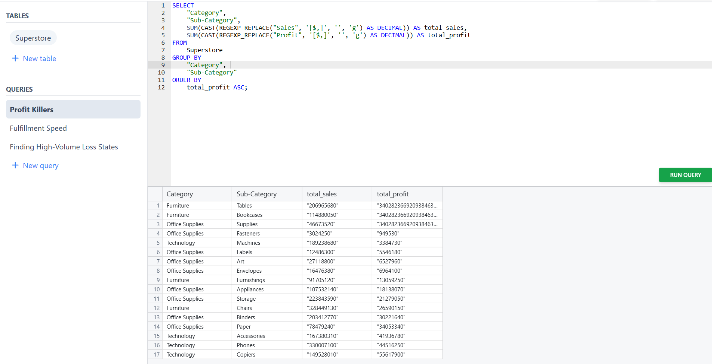
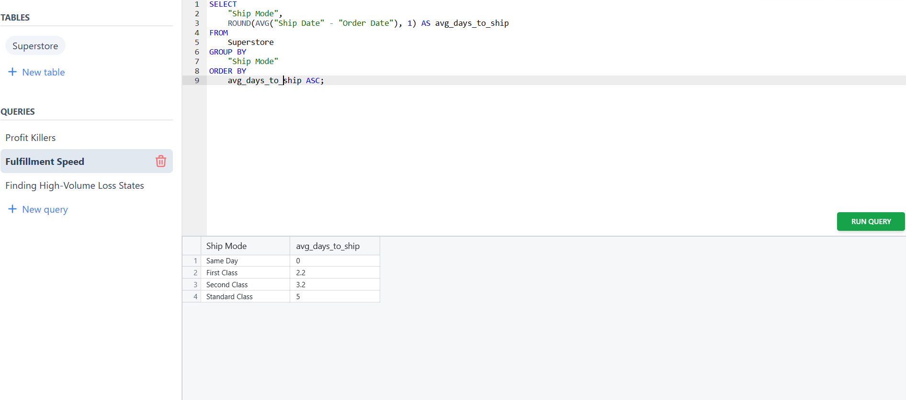
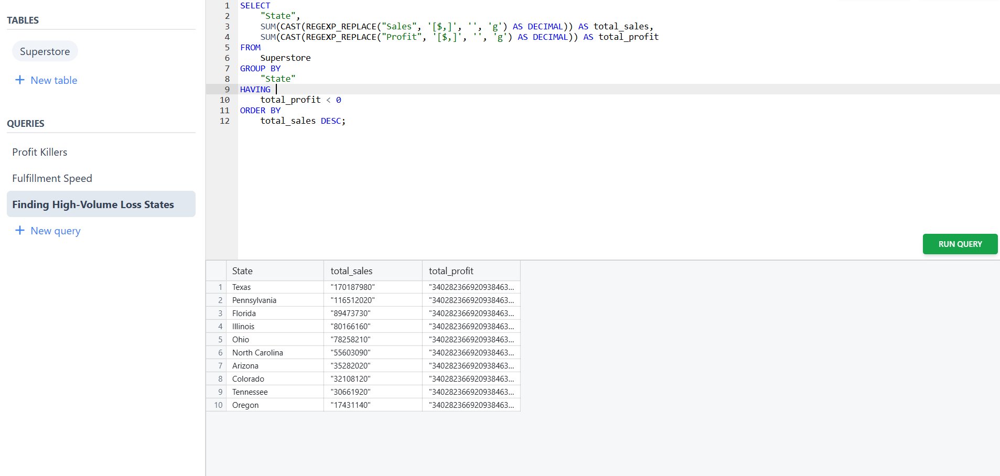
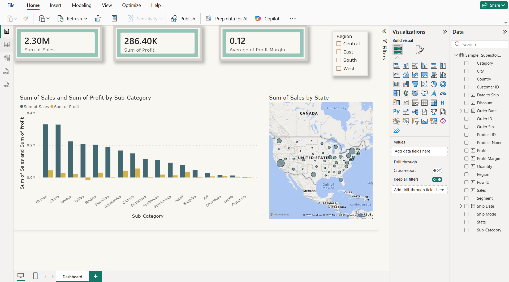

# 📊 E-Commerce Profit Optimization Project

An end-to-end data analytics project that audits, cleans, and optimizes over 10,000 retail transactions. Using **Excel**, **Power BI**, **SQL**, and **Python**, this project tracks down critical operational bottlenecks, engineers business metrics, and exposes major profit deficits to drive strategic corporate decisions.

---

## 📌 Project Overview

Operational data often hides massive financial leaks behind high sales volumes. This project takes raw, messy transaction records from a large-scale Superstore, standardizes the backend data pipeline, isolates severe negative-profit anomalies, and translates the findings into an interactive executive dashboard.

---

## 🚀 Features

- 🧹 Advanced Data Auditing & Text-to-Date Standardization
- 📐 Custom Metrics Engineering (`Days to Ship`, `Profit Margin`)
- 🚨 Automated Conditional Formatting Alarm Systems
- 🧩 Multi-Level Data Aggregation using Pivot Tables
- 🗺️ Interactive Regional Power BI Dashboard
- 🖥️ Production-Ready SQL Data Cleansing Queries
- 🤖 Single-Click Pandas Automation Script

---

## 🛠️ Technologies Used

- Excel (Pivot Tables, Advanced Formulas)
- Power BI (DAX, KPI Cards, Map Visuals, Slicers)
- SQL (MySQL)
- Python (Pandas, Regular Expressions)

---

## 📂 Dataset

**Dataset:** E-Commerce Superstore Transactions

- Original Dataset: **9,994 retail transaction records**
- Timeline: **4 Years of historical sales history**

Dataset Columns:
- Order Date & Ship Date (Standardized)
- Product Category & Sub-Category
- Sales (Revenue)
- Profit (Net Income)
- Discount
- Days to Ship (Calculated)
- Profit Margin (Calculated)

---

## 📊 Dashboard Features

### Executive Overview Page

- **High-Level KPI Cards:** Macro business tracking ($2.29M total sales and $286K total profit).
- **Geographic Mapping:** High-volume, profit-bleeding territories highlighted visually (e.g., Texas).
- **Regional Slicers:** Dynamic cross-filtering by territory to spot performance discrepancies instantly.
- **Product Category Performance Grid:** Real-time breakdown of structural product health.

---

## 📷 Dashboard & Query Preview

### SQL Query & Insight Grid

> Add your screenshot here after uploading.



> Add your screenshot here after uploading.



> Add your screenshot here after uploading.



### Power BI Executive Dashboard

> Add your screenshot here after uploading.



---

## 📁 Project Structure

```text
Ecommerce-Profit-Optimization/
│
├── data/
│   ├── Sample_Superstore.csv
│   └── Sample_ Superstore -Profit Killers.xlsx
│   └── Sample_ Superstore - Logistics Performance.xlsx
│
├── sql/
│   └── Sample_ Superstore -SQL- Dataset.csv
│
├── scripts/
│   └── SUPERSTORE.ipynb
│
├── dashboard/
│   └── Sales-Superstore-PowerBi.pbix
│
├── screenshots/
│   ├── Sql1.png
│   └── Sql2.png
│   └── Sql3.png
│   └── SalesDashboard.png
│
└── README.md
